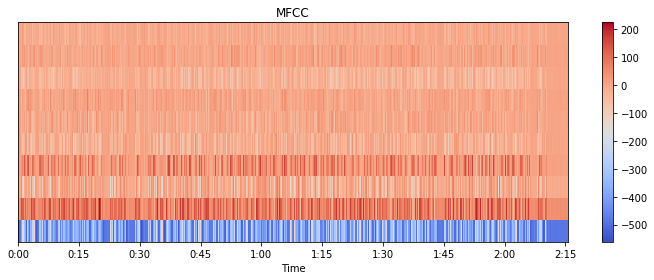
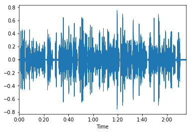

```python
import librosa
import librosa.display
import matplotlib.pyplot as plt
```


```python
y, sr = librosa.load("./chinese_guwenguanzhi_zuozhuan_sn_64kb.mp3")
mfccs = librosa.feature.mfcc(y=y, sr=sr, n_mfcc=10)
plt.figure(figsize=(10, 4))
librosa.display.specshow(mfccs, x_axis='time')
plt.colorbar()
plt.title('MFCC')
plt.tight_layout()

```





```python
librosa.display.waveplot(y, sr=sr)
```


    <matplotlib.collections.PolyCollection at 0x7f3d9dd96b38>





```python
print(mfccs)
```

    [[-5.61378717e+02 -5.61378717e+02 -5.61378717e+02 ... -4.87191378e+02
      -4.83527317e+02 -4.85912962e+02]
     [-2.17138748e-14 -2.17138748e-14 -2.17138748e-14 ...  4.24768635e+01
       4.60739229e+01  4.51665385e+01]
     [ 1.13698650e-14  1.13698650e-14  1.13698650e-14 ... -9.23069253e+00
      -9.75772614e+00 -8.43690812e+00]
     ...
     [-6.53809597e-14 -6.53809597e-14 -6.53809597e-14 ...  1.03489504e+01
       1.26619236e+01  1.60669179e+01]
     [ 2.83990054e-14  2.83990054e-14  2.83990054e-14 ...  1.08837798e+01
       9.71577372e+00  8.62042848e+00]
     [-2.24734177e-14 -2.24734177e-14 -2.24734177e-14 ...  4.57213523e+00
       3.14526803e-01  1.42105212e+00]]

